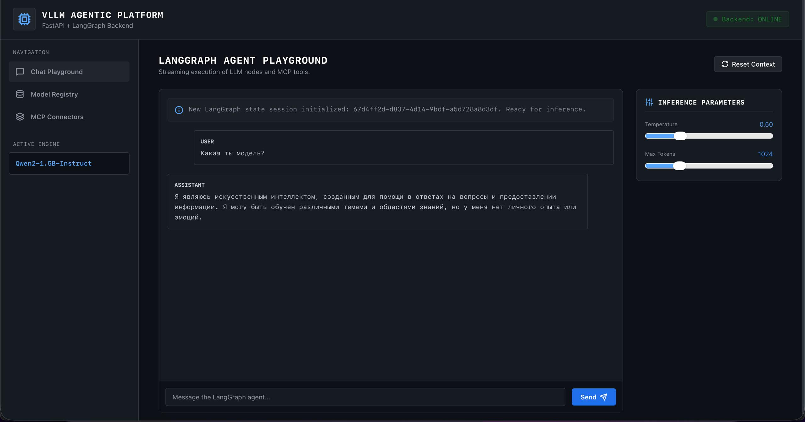

# Agent Inference Platform

This project is a platform for inference model from HuggingFace. Supports vLLM models and MCP tools usage.

## Usage instruction

```Bash
git clone https://github.com/BondusS/Agent-Inference-Platform.git
cd Agent-Inference-Platform

pip install -r requirements.txt
python backend/main.py
docker-compose up -d --build prometheus-monitoring grafana-visualizer postgres-vllm-db
mlflow ui
```

## Services available
* `Main application` - http://127.0.0.1:8000 (to use application go here)
* `Grafana` - http://127.0.0.1:3000 (resources usage dashboard)
* `MlFlow` - http://127.0.0.1:5000 (service usage dashboards & data)
* `Prometheus` - http://127.0.0.1:9090

---

